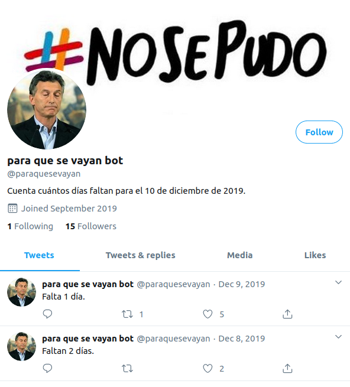

# Twitter Date Bot

Twitter bot that shares a tweet until a specific date comes.

## How to use it

To run your app locally:

- Put your twitter data in the twitter-lite client in index.js
- Put your desired date in config/defaults.json
- Put your desired tweet message on getTweetOptions function in index.js
- Run `npm i`
- Run `npm start`
- That's it, don't need to keep it running

To repeatedly run your app:

- Complete path to your app in cron/run_bot.sh
- Copy your command inside your cron jobs (usually in /etc/cron.<period>/)
- Make sure your bash command has the needed OS permissions to run

To run tests (cucumber-js):

- Run `npm run test`

## Real life example

I put up a twitter bot to show my love interest how does the npm and nodejs work. We setup a bot that every day tweeted until the infamous presidency of maurizio macri came to end in Argentina. (December 10th, 2019)

## If you used and enjoyed

Give me a star, follow or PR ;)